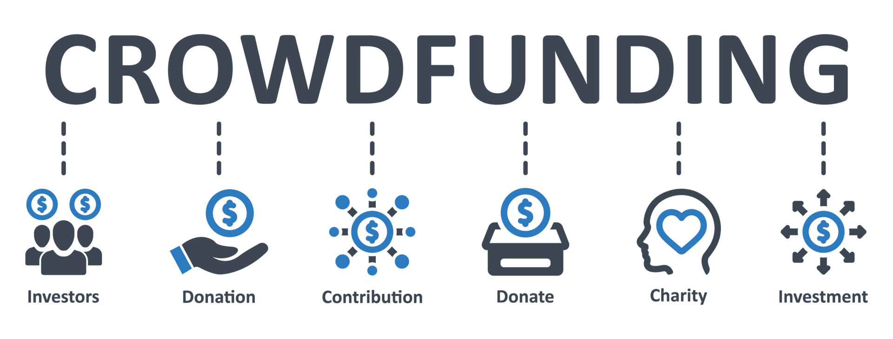

# Student Crowdfunding Platform

The Student Crowdfunding Platform is a decentralized application (dApp) built on Ethereum that allows students to create and manage crowdfunding campaigns for their educational needs. This platform uses smart contracts to ensure transparency, security, and efficiency in raising funds.




## Vision

Our vision is to empower students by providing a decentralized and transparent platform for crowdfunding their educational projects. We aim to bridge the gap between educational needs and funding by leveraging blockchain technology to offer a secure, efficient, and user-friendly platform for both campaign creators and contributors.

## Project Features

- **Campaign Creation**: Students can create new crowdfunding campaigns with details such as title, description, goal amount, deadline, and category.
- **Contributions**: Users can contribute to campaigns and leave donation messages.
- **Campaign Management**: Campaign owners can withdraw funds, issue refunds, update campaign information, set privacy options, and manage reviews.
- **Campaign Privacy**: Option to set campaigns as private and specify allowed viewers.
- **Refunds**: Automated refund process for contributors if the campaign goal is not met by the deadline.
- **Updates and Reviews**: Campaign owners can post updates, and contributors can leave reviews and ratings.
- **Extended Deadlines**: Option for campaign owners to extend deadlines if needed.
- **Minimum Contribution**: Set a minimum contribution amount for campaigns.
- **Refund Deadline**: Set a deadline for refund eligibility.

## Future Scope

- **Integration with DeFi**: Integrate with decentralized finance (DeFi) platforms to offer additional financial products like yield farming or staking for campaign funds.
- **Enhanced Privacy Features**: Implement advanced privacy features, including encryption for donation messages and campaign details.
- **Mobile Application**: Develop a mobile application to allow users to manage campaigns and contributions on the go.
- **Cross-Platform Integration**: Integrate with other blockchain platforms and services to expand the reach and functionality of the crowdfunding platform.
- **Advanced Analytics**: Provide detailed analytics and reporting tools for campaign creators and contributors to track campaign performance and impact.
- **Multilingual Support**: Offer support for multiple languages to cater to a global audience.

## Project Structure

```
/student-crowdfunding
│
├── /contracts
│   ├── StudentCrowdfunding.sol       # Smart contract for crowdfunding logic
│
├── /frontend
│   ├── /public
│   │   ├── index.html                # Main HTML file
│   │   ├── app.js                    # JavaScript code for interacting with the smart contract
│   │   └── styles.css                # CSS styles for the frontend
│   └── /src
│       └── contractABI.json          # ABI file for the smart contract
│
├── /scripts
│   ├── deploy.js                     # Deployment script for the smart contract
│
├── /tests
│   ├── campaign.test.js              # Tests for the smart contract functions
│
├── .gitignore                        # Git ignore file to exclude unnecessary files
├── README.md                         # Project documentation
└── package.json                      # Project dependencies and scripts
```

## Developer Details

**Project Lead**: [Arpita Khobragade]  
**Email**: [arpitakhobragade2308]  
**GitHub**: [Your GitHub Profile]  
**LinkedIn**: [Your LinkedIn Profile]  

**Contributors**:  
- [Contributor Name 1] - [Role/Contribution]  
- [Contributor Name 2] - [Role/Contribution]  

## Deployment
Chain Name: Educhain Open Campus
Contract Address:0x10551955db679b3edb15d5bf49486bbc945588cf
[alt text](c:\Users\Arpita Khobragade\OneDrive\Pictures\Screenshots\Screenshot (559).png)

## Installation

1. **Clone the Repository**:
   ```bash
   git clone https://github.com/your-username/student-crowdfunding.git
   cd student-crowdfunding
   ```

2. **Install Dependencies**:
   ```bash
   npm install
   ```

3. **Deploy Smart Contract**:
   1. Open [Remix IDE](https://remix.ethereum.org/).
   2. Copy the `StudentCrowdfunding.sol` contract code into a new file.
   3. Compile the contract and deploy it to the desired Ethereum network.
   4. Note the deployed contract address.

4. **Configure Frontend**:
   1. Open `frontend/src/contractABI.json` and update it with your contract's ABI.
   2. Open `frontend/public/app.js` and update the contract address and network configuration.

5. **Run the Application**:
   Open `frontend/public/index.html` in your browser.

## Usage

- **Create Campaign**: Use the provided form to create a new crowdfunding campaign.
- **Contribute**: Enter the campaign ID and contribution amount to support a campaign.
- **Manage Campaign**: Campaign owners can withdraw funds, update campaign details, and set privacy options.

## License

This project is licensed under the MIT License. See the [LICENSE](LICENSE) file for details.

## Acknowledgments

- [Remix IDE](https://remix.ethereum.org/) for smart contract development.
- [Web3.js](https://github.com/ethereum/web3.js/) for blockchain interactions.
- [MetaMask](https://metamask.io/) for Ethereum wallet integration.
- [Infura](https://infura.io/) for Ethereum node access.

```

This `README.md` provides a comprehensive guide to the Student Crowdfunding platform, including its vision, features, future scope, project structure, and developer details. Adjust it as needed based on your project specifics and team details.
